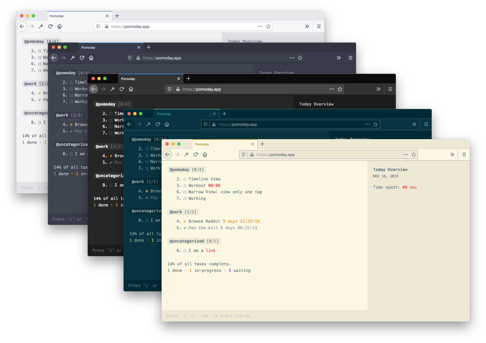

<p align="center"></p>
<p align="center" style="font-weight: bold; text-align: center; font-family: monospace; padding-bottom: 15px;">Be productive without leaving your keyboard</p>

<p align="center" style="text-align: center;"><a href="https://opencollective.com/pomoday-project" alt="Financial Contributors on Open Collective"></a>  </p>

<p align="center">Try it online at https://pomoday.vercel.app</p>

---

- [What is Pomoday?](#what-is-pomoday)
- [Features](#features)
- [Usage and Installation](#usage-and-installation)
    - [Online version](#online-version)
    - [Self-hosted](#self-hosted-version)
- [Development](#development)
- [Syncing across devices](#syncing-across-devices)
- [Similar Projects](#similar-projects)
- [Backers and Sponsors](#backers-and-sponsors)
- [License](#license)

---

## What is Pomoday?



Pomoday is an easy to use, yet powerful and flexible web-based task management software that you can use with just a keyboard.

It's flexible and doesn't tie with any productivity methodologies, that means, you
can customize and use it in anyway you want, try implementing yourself a GTD or Kanban or
Pomodoro workflow with it.

## Features

1. Task management (of course)
2. Keyboard only workflow
3. Built-in time tracker
4. Activities log to get an overview on how you spent your day
5. Dark mode
6. (A lot coming...)

## Usage and Installation

There are two ways to use Pomoday:

### Online version

You can use the online version at https://pomoday.app

### Self-hosted version

Please make sure you have `node` and `npm` installed on your machine.

To host Pomoday locally or on your own server:

1. Clone this repository
  ```
  git clone https://github.com/huytd/pomoday-v2
  ```
2. Install the dependencies
  ```
  npm install
  ```
3. Build
  ```
  npm run dist
  ```
4. Now you can deploy the `dist` folder anywhere, just like a static web page

It's recommended to deploy it to [now.sh](https://now.sh), because it's easy:

```
$ cd dist
$ now
```

## Development

To run it locally during development, use:

```
npm run dev
```

## Docker

This repo includes a `Dockerfile` and a `docker-compose.yml` to easily run the project in a container. Just run the following two commands to build the container image and start it up:

```
$ docker-compose build
$ docker-compose up -d
```

## Syncing across devices

To sync the data across devices, you'll need to implement your own backend, please see [Backend API Specification](https://github.com/huytd/pomoday-v2/wiki/Pomoday-Backend-API-Specification) for the details.

To use https://pomoday.app with your own backend, there's a `login` command in the app, you'll be able to put your backend API URL there.

You can also check the list of [3rd party backend](https://github.com/huytd/pomoday-v2/wiki/Backend-(for-data-synchronize)) for self-hosted options.

## Similar Projects

- [taskbook](https://github.com/klaussinani/taskbook): This is an awesome task management application that actually works, and works very well for everyone who likes to live in a command line. Pomoday was also heavily inspired by Taskbook, as you can see from the UI and the keyboard-only command interfaces.

## Backers and Sponsors

I would like to give a special thanks to all of the advisors and backers who sponsored this project since day-zero.

| <a href="https://github.com/imhuyqn"></a> | <a href="https://github.com/ledongthuc"></a> | <a href="https://github.com/trungfinity"></a> | <a href="https://github.com/thaod"></a> | <a href="https://github.com/mquy"></a> | <a href="https://github.com/quannt"></a> | <a href="https://github.com/dvkndn"> |
|:--:|:--:|:--:|:--:|:--:|:--:|:--:|
|[**imhuyqn**](https://github.com/imhuyqn)|[**ledongthuc**](https://github.com/ledongthuc)|[**trungfinity**](https://github.com/trungfinity)|[**thaod**](https://github.com/thaod)|[**mquy**](https://github.com/mquy)|[**quannt**](https://github.com/quannt)|[**dvkndn**](https://github.com/dvkndn)|

## Contributors

### Code Contributors

This project exists thanks to all the people who contribute. [[Contribute](CONTRIBUTING.md)].
<a href="https://github.com/huytd/pomoday-v2/graphs/contributors"></a>

### Financial Contributors

Become a financial contributor and help us sustain our community. [[Contribute](https://opencollective.com/pomoday-project/contribute)]

#### Individuals

<a href="https://opencollective.com/pomoday-project"></a>

#### Organizations

Support this project with your organization. Your logo will show up here with a link to your website. [[Contribute](https://opencollective.com/pomoday-project/contribute)]

<a href="https://opencollective.com/pomoday-project/organization/0/website"></a>
<a href="https://opencollective.com/pomoday-project/organization/1/website"></a>
<a href="https://opencollective.com/pomoday-project/organization/2/website"></a>
<a href="https://opencollective.com/pomoday-project/organization/3/website"></a>
<a href="https://opencollective.com/pomoday-project/organization/4/website"></a>
<a href="https://opencollective.com/pomoday-project/organization/5/website"></a>
<a href="https://opencollective.com/pomoday-project/organization/6/website"></a>
<a href="https://opencollective.com/pomoday-project/organization/7/website"></a>
<a href="https://opencollective.com/pomoday-project/organization/8/website"></a>
<a href="https://opencollective.com/pomoday-project/organization/9/website"></a>

## License

Pomoday is published under BSD 3-Clause license.

